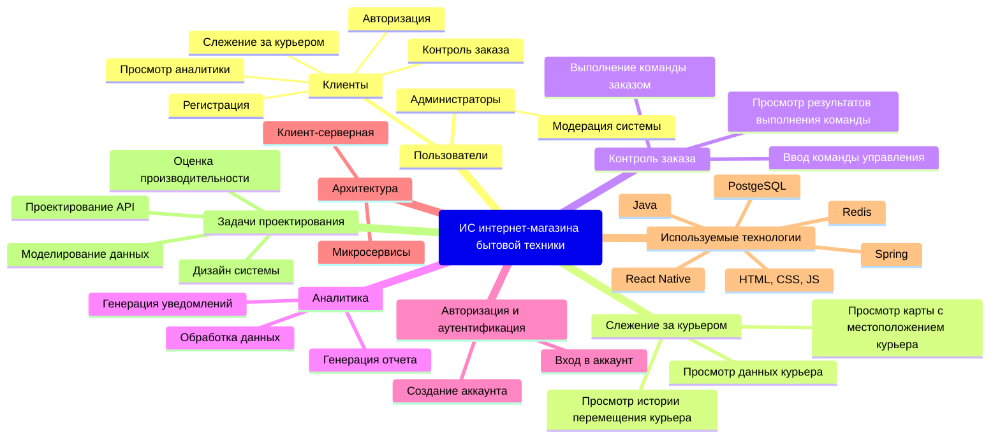
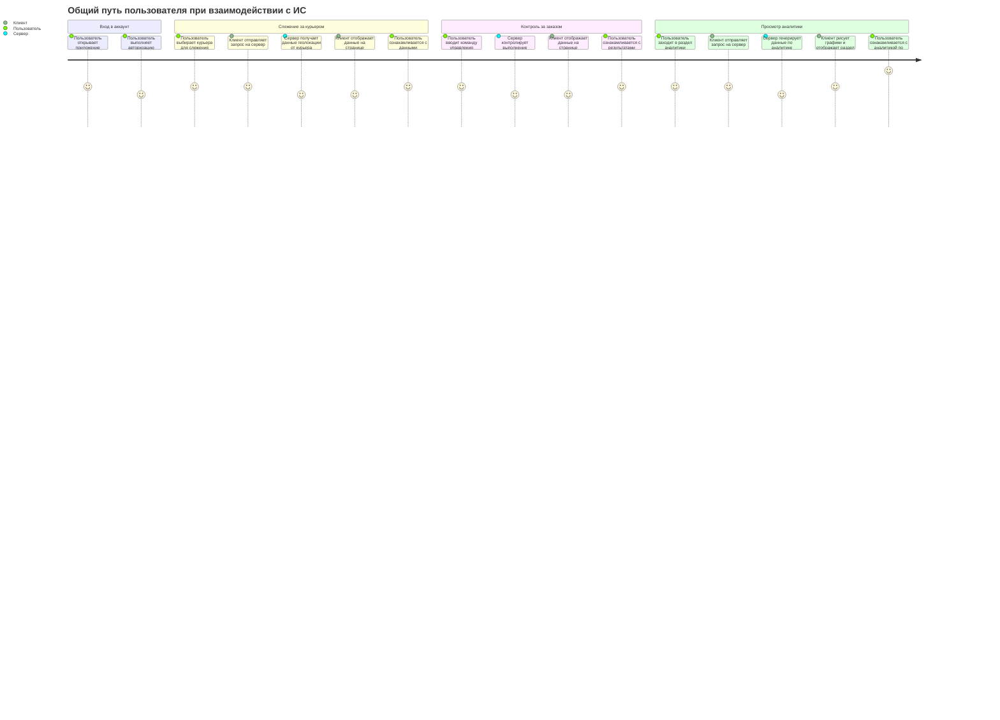
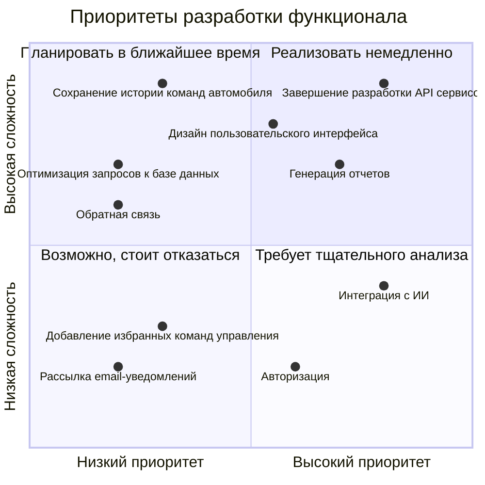
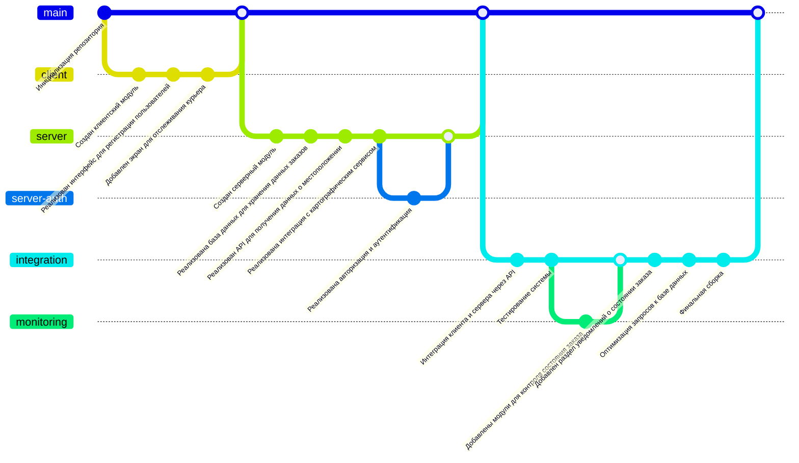

# Информационная система интернет-магазина бытовой техники

Информационная система интернет-магазина бытовой техники позволяет получать данные заказа, контролирвоать заказ, генерирвоать аналитику по состоягию заказа, следить за курьером

## 1. Структура функциональных возможностей (Mind Map)

## 2. Диаграмма путешествия пользователя (User Journey Diagram)

## 3. Квадрант-граф (Quadrant Chart)

## 4. Git-граф

