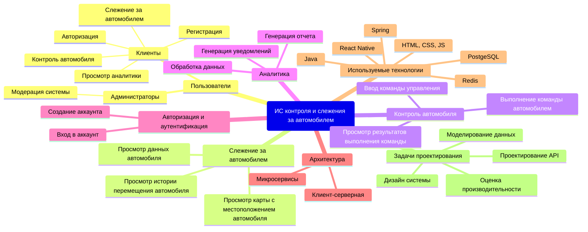
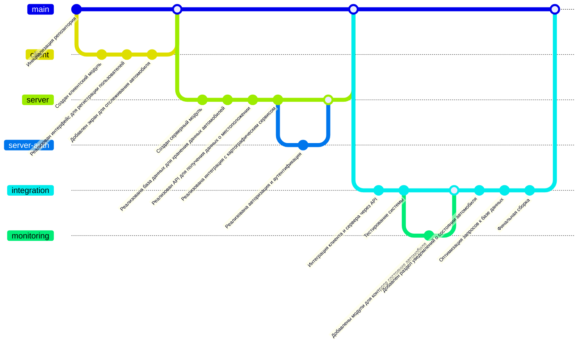

# Информационная система контроля и слежения за автомобилем

Информационная система контроля и слежения за автомобилем позволяет получать данные с датчиков автомобиля, контролирвоать автомобиль, генерирвоать аналитику по состоягию автомобиля

## 1. Структура функциональных возможностей (Mind Map)

## 2. Диаграмма путешествия пользователя (User Journey Diagram)

## 3. Квадрант-граф (Quadrant Chart)

## 4. Git-граф

